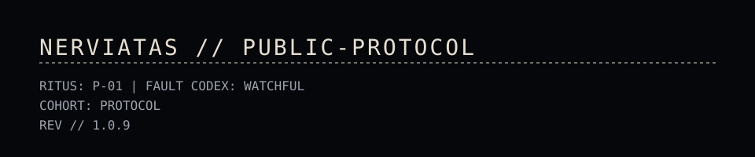

<!--
  NERVIATAS // PUBLIC REPO NOTICE

  RITUS:  P-01
  COHORT: PUBLIC / CONTROLLED DISTRIBUTION

  This documentation is published for transparency and interaction with
  Nerviatas projects on GitHub. It is not a grant of rights to reuse or
  rebrand the content. See LICENSE in this repository for terms.
-->

# Public Protocol

<!-- # NERVIATAS // CYBERNETICS -->

## 00 // Who are we

Nerviatas unites a new class of neuro‑technologies: neural interfaces,
intelligent firmware, and control systems that restore, extend, and dignify
human capability.

Our engineering ethos is forged in ritual. Our designs are precise, disciplined,
resilient, and refined. Our goal is not to be flashy or loud.

We value anatomical elegance, data & human sovereignty, and rigorous
constraints. Power without constraint is failure. We're not here to fail.

We uphold a _Codex Virtutum_ that describes the _Guiding Principles for Ethical
Cybernetics_. View it here: [NERVIATAS // CODEX](https://nerviatas.com/codex).

> “Every limb belongs to a greater body.”

## 01 // What we do

We build responsive prosthetics and human augmentation. Our focus is robustness,
low-latency, fault-tolerance, and engineering that is transparent and
verifiable.

## 02 // Why this matters

Prosthetic control trades speed for stability. Research teams need quick
iteration. Users need reliability every time they move. Our stack serves both
needs without hidden magic. We're not here to trade. We're here to build a new
system. _The Nerviatas System_.

## 03 // What is open here

You will find high level docs, example schemas, and small utilities that help
the community. Core production code lives in private repos. We publish what is
useful to others and does not create safety risk.

## 04 // Work with us

If you work in prosthetics, control, embedded, perception, or tooling and this
direction resonates, reach out. Tell us what you have built and what you want to
build next.

- Email: `hello@nerviatas.com`
- Site: [NERVIATAS // CYBERNETICS](https://nerviatas.com)

## 05 // Responsible use

We build systems that interact with people. Any use must include risk analysis,
limits, and supervised validation. Do not deploy our examples on devices that
can harm users or bystanders. Test offline first. Then hardware in the loop.
Then field trials with proper oversight.

## 06 // Legal

Use of any public code in this organization is governed by the license file in
the respective repository. If a repo does not include a license file then it is
not licensed for reuse.

Our **Privacy Policy** can be found at
[NERVIATAS // PRIVACY](https://nerviatas.com/privacy), and our **Terms &
Conditions** can be found at [NERVIATAS // TERMS](https://nerviatas.com/terms).

If you have any questions feel free to contact us at `privacy@nerviatas.com` or
`legal@nerviatas.com`.

---

> **NERVI // ATAS** | _“Reliability by ritual. Precision by design.”_

<!--
  NERVIATAS PROPRIETARY // MARKDOWN DOCUMENT
  Copyright (c) 2025 Nerviatas. All rights reserved.

  This file and its contents are confidential and proprietary to Nerviatas.
  No license is granted or implied by this notice. Use, copying, modification,
  or distribution is permitted only under the terms described in LICENSE.
-->
